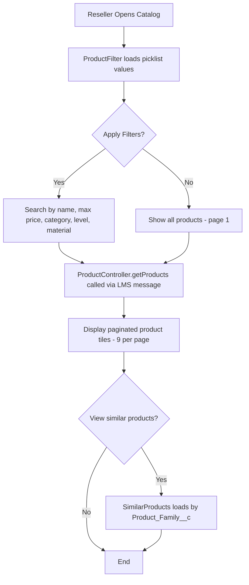
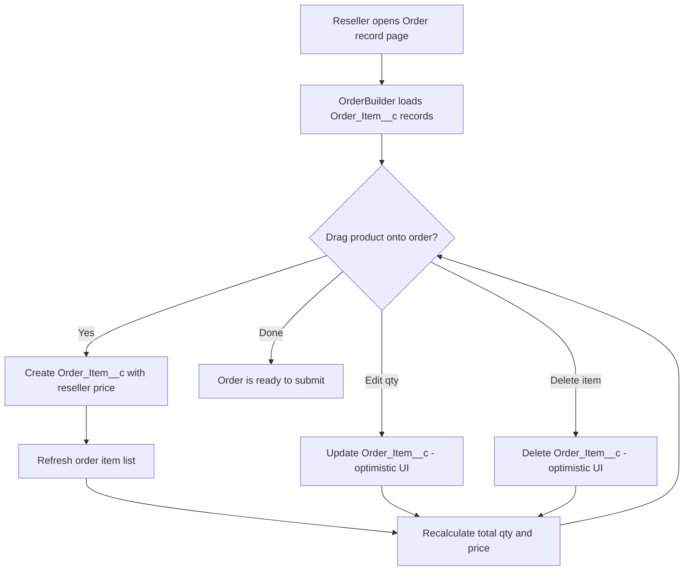
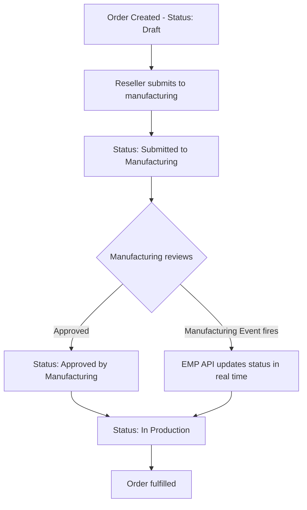
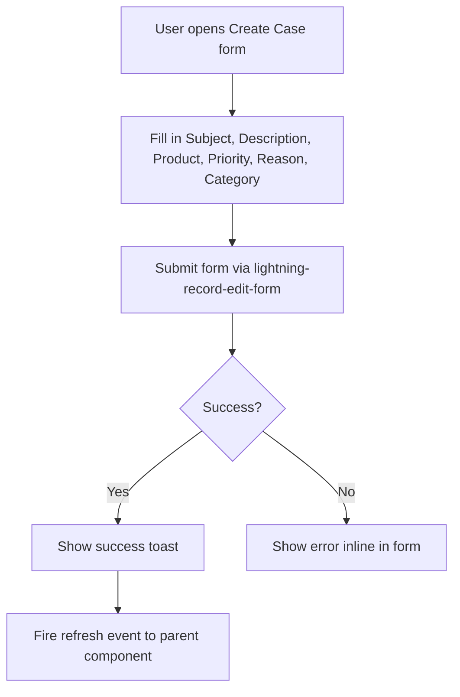

# Business Processes & Domain

## Overview

eBikes is a Salesforce-based B2B electric bike distribution platform. Resellers browse an eBike product catalog, build orders by selecting products with size-based quantities, and submit those orders to manufacturing. The manufacturing team approves and tracks production in real time via Platform Events. A community-facing support flow allows users to create Cases for product issues.

---

## Core Flows

### 1. Product Discovery & Browsing

**Trigger**: Reseller opens the product catalog page  
**Actors**: Reseller (community user)

**Steps**:
1. **Filter Panel Loads** — Category, Level, and Material picklist values are fetched via `getPicklistValues`
   - Actor: System
   - Output: Filter checkboxes populated
2. **User Applies Filters** — User types a search keyword, adjusts max price slider, or checks category/level/material checkboxes
   - Actor: Reseller
   - Input: `searchKey`, `maxPrice`, `categories[]`, `levels[]`, `materials[]`
   - Output: `ProductsFiltered__c` LMS message published (debounced 350ms)
3. **Products Load** — `ProductController.getProducts` called with active filters and page number; returns 9 products per page with total count
   - Actor: System / Apex
   - Output: Paginated `Product__c[]`
4. **User Browses & Paginates** — Reseller scrolls through product tiles and advances pages
5. **Similar Products Displayed** — On a product detail page, `getSimilarProducts` returns other products in the same `Product_Family__c`

**Outcome**: Reseller identifies the products they want to order

**Business Rules**:
- Page size is fixed at **9 products per page**
- Filters are combined with AND logic
- LMS message channel `ProductsFiltered__c` decouples the filter panel from the product list

---

### 2. Order Building (Reseller Ordering)

**Trigger**: Reseller opens an Order record page and drags products from the catalog  
**Actors**: Reseller

**Steps**:
1. **Load Order Items** — `OrderController.getOrderItems` wire-fetches all `Order_Item__c` records for the current `Order__c`, including related `Product__c.Name`, `MSRP__c`, `Picture_URL__c`
   - Actor: System
2. **Add Product via Drag-and-Drop** — Reseller drags a product tile onto the order builder; a new `Order_Item__c` is created with `Price__c = MSRP * 0.6` (40% reseller discount)
   - Actor: Reseller
   - Input: `Product__c` data transferred via HTML5 drag-and-drop
   - Output: New `Order_Item__c` record created via `createRecord`
3. **Update Quantities** — Reseller adjusts S / M / L quantities on each line item; change is applied optimistically on client and persisted via `updateRecord`
   - Actor: Reseller
   - Input: `Qty_S__c`, `Qty_M__c`, `Qty_L__c`
4. **Remove Item** — Reseller removes a product; deleted optimistically on client and via `deleteRecord`
5. **Live Summary** — Order total quantity and total price recalculate client-side after each change
   - Formula: `totalPrice = Σ (Price__c × (Qty_S + Qty_M + Qty_L))`

**Outcome**: Order__c has a complete set of Order_Item__c line items ready for submission to manufacturing

**Business Rules**:
- Reseller price = **MSRP × 0.6** (40% discount off MSRP); TODO: move discount to a custom field on Account
- Quantities are tracked in **three sizes: Small (S), Medium (M), Large (L)**
- UI uses **optimistic updates** — client reflects the change immediately; rolls back on server error

---

### 3. Order Status & Manufacturing Lifecycle

**Trigger**: Order is submitted to manufacturing or manufacturing updates the order status  
**Actors**: Reseller, Manufacturing Team

**Steps**:
1. **Draft Order** — Order is created with default status `Draft`
2. **Submit to Manufacturing** — Status manually advanced to `Submitted to Manufacturing` via path component click
3. **Manufacturing Approval** — Manufacturing team reviews and updates status to `Approved by Manufacturing`
4. **Real-Time Status Update via Platform Event** — `Manufacturing_Event__e` platform event fires with `Order_Id__c` and `Status__c`; the `orderStatusPath` LWC subscribes via EMP API and immediately reflects the new status without a page refresh
5. **In Production** — Final status; order is being physically manufactured

**Outcome**: Reseller sees live production status on the Order record page

**Business Rules**:
- Order status is a **restricted picklist** — only defined values are valid
- Status progression: `Draft` → `Submitted to Manufacturing` → `Approved by Manufacturing` → `In Production`
- `Manufacturing_Event__e` is a **High Volume** platform event published after commit
- EMP API subscription is scoped to the current Order record (`Order_Id__c === recordId`)

---

### 4. Case Creation (Customer Support)

**Trigger**: User (reseller or community member) encounters a product issue and files a support case  
**Actors**: Reseller / Community User

**Steps**:
1. **Open Case Form** — `createCase` LWC renders a `lightning-record-edit-form` for the `Case` object
2. **Fill Case Details** — User enters Subject, Description, selects related Product, sets Priority, Reason, and Case Category
3. **Submit** — Standard LDS record creation via `lightning-record-edit-form`
4. **Success Feedback** — Toast notification "Case Created!" fires; parent component is notified via a `refresh` custom event

**Outcome**: A new Case record is created in Salesforce linked to the relevant Product

**Business Rules**:
- Case fields captured: `Subject`, `Description`, `Product__c`, `Priority`, `Reason`, `Case_Category__c`
- Case creation is handled entirely via LDS (no custom Apex)

---

## Edge Cases & Exceptions

### Order Item Create Failure
- **Trigger**: Server error when creating `Order_Item__c` after product drop
- **Handling**: Error toast displayed; order item is NOT added to the list (no optimistic create — list is refreshed from server)

### Order Item Update / Delete Failure
- **Trigger**: Server error when updating or deleting an `Order_Item__c`
- **Handling**: Client-side state is **rolled back** to the previous order items; error toast displayed

### EMP API Unavailable
- **Trigger**: `isEmpEnabled()` returns false
- **Handling**: Error message displayed on the `orderStatusPath` component; status updates must be done manually

### EMP API Subscription Error
- **Trigger**: Failed subscription to `Manufacturing_Event__e` channel
- **Handling**: Error message captured and surfaced via `reportError`; component continues to show current status

---

## Business Rules Summary

| Rule ID | Rule | Applies To | Enforcement |
|---------|------|------------|-------------|
| BR-001 | Reseller price = MSRP × 0.6 (40% discount) | Order_Item__c creation | Client-side constant `DISCOUNT = 0.6` in `orderBuilder.js` |
| BR-002 | Order items track quantity in 3 sizes: S, M, L | Order_Item__c | Fields `Qty_S__c`, `Qty_M__c`, `Qty_L__c` |
| BR-003 | Order default status is "Draft" | Order__c | Picklist default on `Status__c` field |
| BR-004 | Order status is a restricted picklist | Order__c | `<restricted>true</restricted>` on `Status__c` |
| BR-005 | Product categories: Mountain, Commuter | Product__c | Restricted picklist on `Category__c` |
| BR-006 | Product levels: Beginner, Enthusiast, Racer | Product__c | Restricted picklist on `Level__c` |
| BR-007 | Product catalog page size = 9 | ProductController | `PAGE_SIZE = 9` constant in Apex |
| BR-008 | Manufacturing events are high volume, publish after commit | Manufacturing_Event__e | `eventType: HighVolume`, `publishBehavior: PublishAfterCommit` |
| BR-009 | Filter criteria are combined with AND logic | Product browsing | Dynamic SOQL in `ProductController.getProducts` |
| BR-010 | UI uses optimistic updates for order item changes | Order building | Rollback on server error in `orderBuilder.js` |

---

## Domain Glossary

### Core Objects

| Term | Definition | Example |
|------|------------|---------|
| **Product__c** | Custom object representing a single eBike SKU in the catalog | "Trail Blazer 500 - Mountain Racer" |
| **Product_Family__c** | Groups related products (e.g. same model, different configs) for "Similar Products" display | "Trail Blazer Family" |
| **Order__c** | Custom object representing a reseller's purchase order | Order #1001 for a bike shop |
| **Order_Item__c** | Line item on an Order; links a Product to an Order with size quantities and price | 5 Small + 3 Medium Trail Blazers at $1,200 each |
| **Manufacturing_Event__e** | High-volume Platform Event published by manufacturing system to push real-time order status updates | `{Order_Id__c: "001...", Status__c: "In Production"}` |
| **Case** | Standard Salesforce object for customer support requests related to a product | "Defective motor on order #1001" |

### Statuses & States

| Object | Status | Meaning |
|--------|--------|---------|
| Order__c | Draft | Order is being built by reseller; not yet submitted |
| Order__c | Submitted to Manufacturing | Reseller has finalized and sent order to manufacturing team |
| Order__c | Approved by Manufacturing | Manufacturing has reviewed and approved the order |
| Order__c | In Production | Bikes are being physically manufactured |

### Product Attributes

| Attribute | Values | Meaning |
|-----------|--------|---------|
| Category__c | Mountain, Commuter | Type of riding terrain the bike is designed for |
| Level__c | Beginner, Enthusiast, Racer | Rider skill/experience level the bike targets |
| Material__c | (picklist - runtime values) | Frame material (e.g. aluminum, carbon fiber) |
| MSRP__c | Decimal currency | Manufacturer's Suggested Retail Price |

### Actions & Operations

| Action | Description | Trigger |
|--------|-------------|---------|
| Drag-and-drop product | Adds a product to the current order as a new Order_Item__c | Reseller drags product tile onto OrderBuilder drop zone |
| Publish ProductsFiltered | LMS message broadcast when any filter value changes | Filter checkbox toggle or search/price input (debounced 350ms) |
| Publish Manufacturing_Event__e | Platform event broadcast by manufacturing system with new order status | External manufacturing system triggers on status change |
| Refresh order items | Re-queries Order_Item__c from server via `refreshApex` | After a new Order_Item__c is created |
| Optimistic UI update | Client state updated immediately before server confirmation | Order item qty change or delete |

### Abbreviations

| Abbreviation | Full Term | Context |
|--------------|-----------|---------|
| MSRP | Manufacturer's Suggested Retail Price | Product pricing baseline |
| LMS | Lightning Message Service | Cross-component communication (ProductsFiltered__c channel) |
| EMP API | Enterprise Messaging Platform API | Real-time streaming subscription to Platform Events |
| LDS | Lightning Data Service | Salesforce framework for record CRUD without Apex |
| S / M / L | Small / Medium / Large | Order item size variants tracked separately |

---

*Sources: Codebase analysis — Apex controllers, LWC components, and custom object metadata*  
*Generated: 2026-04-24*
