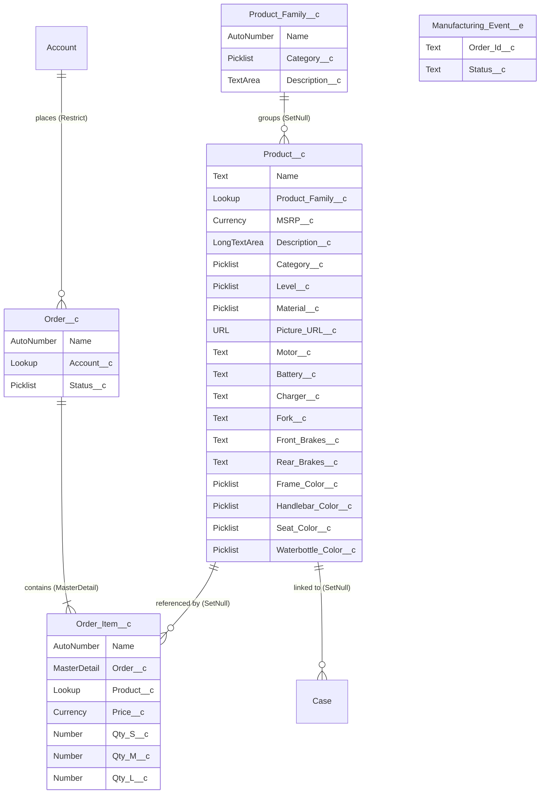

# Data Model

## Overview

| Metric | Count |
|--------|-------|
| Custom Objects | 4 (`Product_Family__c`, `Product__c`, `Order__c`, `Order_Item__c`) |
| Platform Events | 1 (`Manufacturing_Event__e`) |
| Standard Objects Extended | 2 (`Account`, `Case`) |
| Custom Fields (total) | 28 |
| Relationships | 5 |
| Validation Rules | 0 |
| Triggers | 0 |
| Flows | 0 |
| Message Channels (LMS) | 2 |
| Permission Sets | 1 (`ebikes`) |

## Namespaces

| Namespace | Source | Objects |
|-----------|--------|---------|
| (none) | Custom / this project | All objects |

---

## Entity Relationship Diagram

---

## Objects

### 1. Product_Family__c

**Label**: Product Family  
**Plural**: Product Families  
**Name Field**: Text (Product Family Name)  
**Sharing**: ReadWrite  
**Features**: Bulk API, Streaming API  
**Purpose**: Groups related `Product__c` records together (e.g. all Trail Blazer variants). Used by `similarProducts` LWC to find products in the same family.

#### Fields

| API Name | Label | Type | Required | Values / Notes |
|----------|-------|------|----------|----------------|
| `Name` | Product Family Name | Text | Yes (system) | Auto-generated name field |
| `Category__c` | Category | Picklist | No | Commuter, Hybrid, Mountain |
| `Description__c` | Description | TextArea | No | Short description of the family |

#### Relationships
| Type | Direction | Target | Notes |
|------|-----------|--------|-------|
| Lookup (child) | ← | `Product__c.Product_Family__c` | Products that belong to this family |

---

### 2. Product__c

**Label**: Product  
**Plural**: Products  
**Name Field**: Text (Product Name)  
**Sharing**: ReadWrite  
**Features**: Bulk API, Reports, Streaming API, Chatter Groups  
**Record Page**: `Product_Record_Page` (Lightning App Builder Flexipage)  
**Purpose**: Central product catalog — each record represents a single eBike SKU with full technical specifications, pricing, and categorization.

#### Fields

| API Name | Label | Type | Required | Values / Notes |
|----------|-------|------|----------|----------------|
| `Name` | Product Name | Text | Yes (system) | Product display name |
| `Product_Family__c` | Product Family | Lookup → `Product_Family__c` | No | SetNull on parent delete |
| `MSRP__c` | MSRP | Currency(6,0) | No | Manufacturer's Suggested Retail Price |
| `Description__c` | Description | LongTextArea(1000) | No | Full product description |
| `Category__c` | Category | Picklist | No | Mountain \| Commuter |
| `Level__c` | Level | Picklist | No | Beginner \| Enthusiast \| Racer |
| `Material__c` | Material | Picklist | No | Aluminum \| Carbon |
| `Picture_URL__c` | Picture URL | URL | No | External image URL for product display |
| `Motor__c` | Motor | Text(100) | No | Motor specification |
| `Battery__c` | Battery | Text(100) | No | Battery specification |
| `Charger__c` | Charger | Text(100) | No | Charger specification |
| `Fork__c` | Fork | Text(100) | No | Fork specification |
| `Front_Brakes__c` | Front Brakes | Text(100) | No | Front brake specification |
| `Rear_Brakes__c` | Rear Brakes | Text(100) | No | Rear brake specification |
| `Frame_Color__c` | Frame Color | Picklist | No | white \| red \| blue \| green |
| `Handlebar_Color__c` | Handlebar Color | Picklist | No | white \| red \| blue \| green |
| `Seat_Color__c` | Seat Color | Picklist | No | white \| red \| blue \| green |
| `Waterbottle_Color__c` | Waterbottle Color | Picklist | No | white \| red \| blue \| green |

#### Relationships
| Type | Direction | Target | Field | Notes |
|------|-----------|--------|-------|-------|
| Lookup | → | `Product_Family__c` | `Product_Family__c` | SetNull on delete |
| Lookup (child) | ← | `Order_Item__c.Product__c` | — | Order items referencing this product |
| Lookup (child) | ← | `Case.Product__c` | — | Support cases for this product |

#### Apex Usage
- `ProductController.getProducts()` — paginated search with filters (name, maxPrice, Category, Level, Material)
- `ProductController.getSimilarProducts()` — returns sibling products in the same `Product_Family__c`
- `ProductRecordInfoController.getRecordInfo()` — resolves product or family by name

---

### 3. Order__c

**Label**: Reseller Order  
**Plural**: Reseller Orders  
**Name Field**: AutoNumber (`O-{00000}`)  
**Sharing**: ReadWrite (internal), Private (external/community)  
**Features**: Bulk API, Reports, Streaming API, Chatter Groups  
**Record Page**: `Order_Record_Page` (Lightning App Builder Flexipage)  
**Purpose**: Represents a reseller's purchase order. Contains the order lifecycle status and links to a reseller Account. Line items are stored in child `Order_Item__c` records.

#### Fields

| API Name | Label | Type | Required | Values / Notes |
|----------|-------|------|----------|----------------|
| `Name` | Order Number | AutoNumber | Yes (system) | Format: `O-00001` |
| `Account__c` | Account | Lookup → `Account` | **Yes** | Restrict delete — account cannot be deleted if orders exist |
| `Status__c` | Status | Picklist | **Yes** | Default: **Draft**. Values: Draft \| Submitted to Manufacturing \| Approved by Manufacturing \| In Production |

#### Relationships
| Type | Direction | Target | Field | Notes |
|------|-----------|--------|-------|-------|
| Lookup | → | `Account` | `Account__c` | Required; Restrict on delete |
| Master-Detail (parent) | ← | `Order_Item__c.Order__c` | — | Cascade delete of all child items |

#### Apex Usage
- `OrderController.getOrderItems()` — returns all `Order_Item__c` for this order with product details

#### Streaming
- `orderStatusPath` LWC subscribes to `Manufacturing_Event__e` via EMP API; when an event fires for this Order's Id, `Status__c` is updated via `updateRecord`

---

### 4. Order_Item__c

**Label**: Order Item  
**Plural**: Order Items  
**Name Field**: AutoNumber (`OI-{000000}`)  
**Sharing**: ControlledByParent (inherits from `Order__c`)  
**Features**: Bulk API, Streaming API  
**Purpose**: Junction-style line item linking a `Product__c` to an `Order__c` with size-specific quantities and reseller price.

#### Fields

| API Name | Label | Type | Required | Values / Notes |
|----------|-------|------|----------|----------------|
| `Name` | Order Item Number | AutoNumber | Yes (system) | Format: `OI-000001` |
| `Order__c` | Reseller Order | **MasterDetail** → `Order__c` | **Yes** | Position 0; cascade delete; sharing ControlledByParent |
| `Product__c` | Product | Lookup → `Product__c` | No | SetNull if product deleted |
| `Price__c` | Price | Currency(6,0) | No | Reseller price per unit = `MSRP × 0.6` (set at create time) |
| `Qty_S__c` | S | Number(3,0) | No | Default: 1 — Small size quantity |
| `Qty_M__c` | M | Number(3,0) | No | Default: 1 — Medium size quantity |
| `Qty_L__c` | L | Number(3,0) | No | Default: 1 — Large size quantity |

#### Relationships
| Type | Direction | Target | Field | Notes |
|------|-----------|--------|-------|-------|
| MasterDetail | → | `Order__c` | `Order__c` | Required; parent controls sharing; cascade delete |
| Lookup | → | `Product__c` | `Product__c` | SetNull on delete; not required |

#### Apex Usage
- `OrderController.getOrderItems()` — fetches all items for an order including `Product__r.Name`, `Product__r.MSRP__c`, `Product__r.Picture_URL__c`

---

### 5. Manufacturing_Event__e

**Label**: Manufacturing Event  
**Plural**: Manufacturing Events  
**Type**: Platform Event (High Volume)  
**Publish Behavior**: PublishAfterCommit  
**Purpose**: Real-time event published by an external manufacturing system (e.g. the `ebikes-manufacturing` companion app) to push order status updates to the Salesforce UI without polling.

#### Fields

| API Name | Label | Type | Required | Notes |
|----------|-------|------|----------|-------|
| `Order_Id__c` | Order Id | Text(18) | **Yes** | Salesforce record Id of the `Order__c` |
| `Status__c` | Status | Text(255) | **Yes** | New status value to apply (matches `Order__c.Status__c` picklist values) |

#### Consumers
- `orderStatusPath` LWC — subscribes via EMP API (`/event/Manufacturing_Event__e`); filters by `Order_Id__c === recordId`; calls `updateRecord` to set `Status__c`

---

## Standard Objects Extended

### Account (Standard)

Used as the reseller lookup on `Order__c`. No custom fields defined on Account in this project.

| Custom Field | Label | Type | Notes |
|-------------|-------|------|-------|
| *(none)* | — | — | Standard Account object, read-only in eBikes permission set |

**Permission (ebikes PS)**: Read + View All (no create/edit/delete)

---

### Case (Standard)

Extended with two custom fields for eBike-specific support case logging.

| Custom Field | Label | Type | Required | Values / Notes |
|-------------|-------|------|----------|----------------|
| `Case_Category__c` | Case Category | Picklist | No | Mechanical \| Electrical \| Electronic \| Structural \| Other |
| `Product__c` | Product | Lookup → `Product__c` | No | SetNull on product delete; links case to a specific bike |

**Standard fields used in LWC**: `Subject`, `Description`, `Priority`, `Reason`  
**Permission (ebikes PS)**: Full CRUD + View All

---

## Relationships Summary

### Master-Detail (Cascade Delete)

| Parent | Child | Relationship Name | Notes |
|--------|-------|-------------------|-------|
| `Order__c` | `Order_Item__c` | `Order_Items` | Sharing ControlledByParent; non-reparentable |

### Lookups

| From Object | Field | To Object | On Delete | Required |
|-------------|-------|-----------|-----------|----------|
| `Order__c` | `Account__c` | `Account` | **Restrict** | **Yes** |
| `Product__c` | `Product_Family__c` | `Product_Family__c` | SetNull | No |
| `Order_Item__c` | `Product__c` | `Product__c` | SetNull | No |
| `Case` | `Product__c` | `Product__c` | SetNull | No |

### Junction Objects (Many-to-Many)

`Order_Item__c` acts as a junction between `Order__c` and `Product__c` — an Order can have many Products, and a Product can appear on many Orders.

---

## Lightning Message Channels (LMS)

| API Name | Purpose | Publisher | Subscriber |
|----------|---------|-----------|------------|
| `ProductsFiltered__c` | Broadcast filter criteria changes from filter panel to product list | `productFilter` LWC | `productTileList` LWC |
| `ProductSelected__c` | Broadcast a selected product | (available for use) | (available for use) |

---

## Automation Summary

### Triggers
None — no Apex triggers in this project.

### Flows
None — no Flow metadata in this project.

### Apex Controllers

| Class | Methods | Purpose |
|-------|---------|---------|
| `ProductController` | `getProducts(filters, pageNumber)`, `getSimilarProducts(productId, familyId)` | Server-side product search and similarity lookup |
| `OrderController` | `getOrderItems(orderId)` | Fetch order line items with related product fields |
| `ProductRecordInfoController` | `getRecordInfo(productOrFamilyName)` | Resolve a name to a record Id + object type |
| `PagedResult` | — | Wrapper class: `pageSize`, `pageNumber`, `totalItemCount`, `records[]` |

---

## Security Model

### Permission Set: `ebikes`

| Object | Create | Read | Edit | Delete | View All | Notes |
|--------|--------|------|------|--------|----------|-------|
| `Account` | — | ✅ | — | — | ✅ | Read-only |
| `Case` | ✅ | ✅ | ✅ | ✅ | ✅ | Full access |
| `Order__c` | ✅ | ✅ | ✅ | ✅ | ✅ | Full access |
| `Order_Item__c` | ✅ | ✅ | ✅ | ✅ | ✅ | Full + Modify All |
| `Product__c` | ✅ | ✅ | ✅ | ✅ | ✅ | Full + Modify All |
| `Product_Family__c` | ✅ | ✅ | ✅ | ✅ | ✅ | Full + Modify All |
| `Order` (standard) | — | ✅ | — | — | ✅ | Read-only |

All custom fields on `Product__c`, `Order_Item__c`, and `Product_Family__c` are granted read+edit in the `ebikes` permission set.

### Sharing Rules
- `Order__c` external sharing: **Private** — community/guest users cannot see orders unless explicitly shared
- `Product__c`, `Product_Family__c`, `Order_Item__c`: **ReadWrite** OWD — broadly accessible to internal users
- `Order_Item__c`: **ControlledByParent** — access determined by parent `Order__c`

### Apex Execution Context
All Apex controllers use `with sharing` — respect the running user's sharing rules and FLS.

---

## Verification Checklist

- [x] All custom objects documented
- [x] Standard objects in use included (Account, Case)
- [x] Field types accurate
- [x] Relationships mapped correctly
- [x] ERD diagram rendered (Mermaid)
- [x] No namespaces — project is unmanaged
- [x] No validation rules in metadata
- [x] No record types defined
- [x] Permission set security documented

---

*Generated: 2026-04-24*  
*Source: `force-app/main/default/objects/**` metadata analysis + Apex class inspection*
